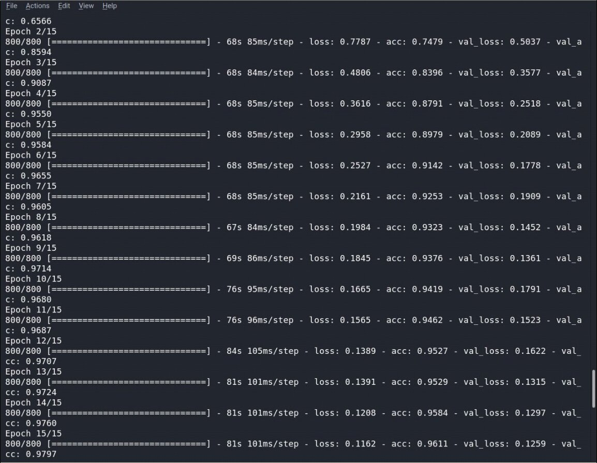
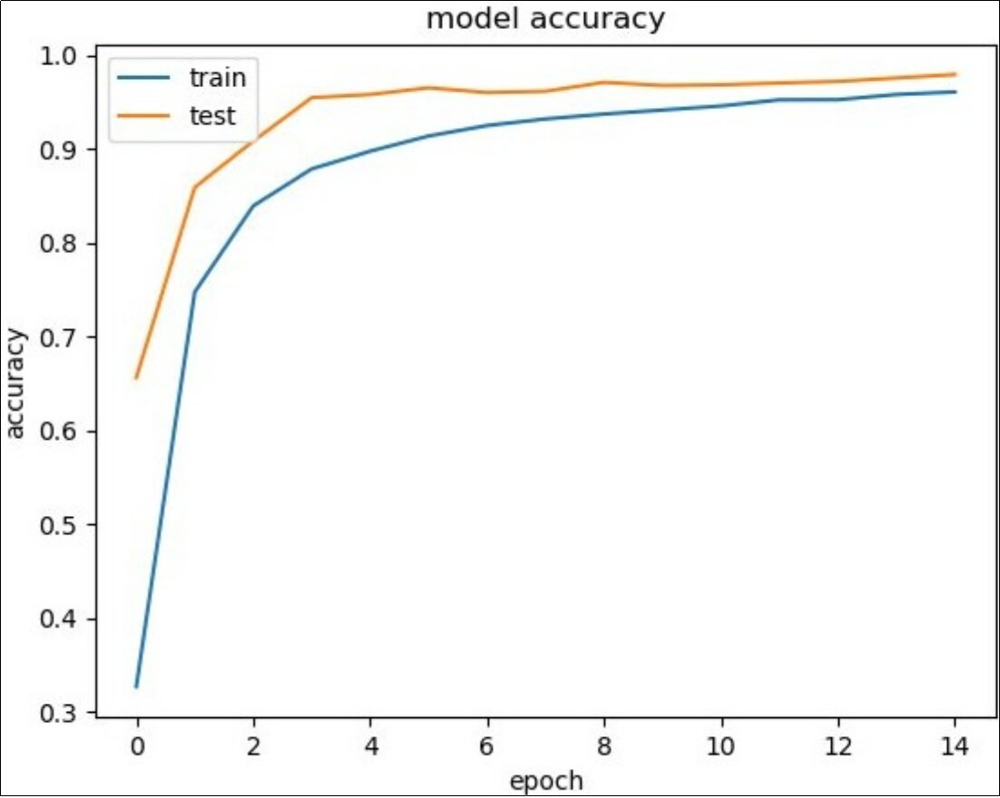

# Sign Language Recognition
Recognizing the sign language with real-time video assistance [Please click to read the article.](https://www.yckircaali.com/sign-language-recognition/)
  
## Requirements
- Python 3.x
- Tensorflow 1.5
- Keras
- OpenCV 3.4
  
## Training a Model
So training can be done with either. If you want to train using run the cnn_model.py.
You do not need to retrain your model every time. In case you added or removed a gesture then you need to retrain it.

We achieved an accuracy of 97%. To classify Sign Language Movements shows that it can be used successfully. Continuous sign language movements our work on getting to know more accurately we want to expand. This method for individual movements, at the sentence level, can also be extended for sign language.

## capture.py
We define a function named capture_images with parameter ges_name to capture the image formed in the camera. We send the value to the create_folder function we created in the previous page with the parameter. We also capture images from the camera with the command cv2.VİdeoCapture (0). We also create a trackbar at the bottom, which will be used to adjust the image created on the camera.

## cnn_model.py
3 Convolution layer and noise command are also included here. There are full link and CNN compile commands.

## test_model.py
At the bottom part, image prediction is done and the predicted letter is printed on the screen. The image to be tested is loaded with the image.load_img () command. Image is converted to numpy array with the image.img_to_array () command. Used to expand the shape of the np.expand_dims array. Classifier.predict The () command creates output estimates for input instances.

## recognise.py
A frame is created on the image with the command cv2.rectangle. cv2.cvtColor () is used to transform an image from one color space to another. Pixel thresholding is performed with the cv2.inRange command. The estimated letter is written on the screen with cv2.putText.
